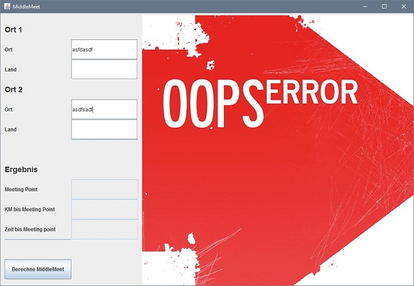

# MiddleMeet

**Semesterarbeit NDK HF Grundlagen Software-Entwicklung** 
von Cla Tschenett und Patrick Stoffel

**Motivation** 
MiddleMeet ist ein Tool, um den optimalen Treffpunkt zwischen zwei Orten zu berechnen. Das Tool ermöglicht
dem User, zwei Orte einzugeben, um anhand von Google Maps Daten zu berechnen, welcher Ort sich genau
zwischen den beiden befindet. Der Anwender erhält als Resultat folgende Informationen zurück:

• Ortsname des Treffpunktes auf halber Strecke 
• Distanz bis zum Treffpunkt 
• Fahrzeit bis zum Treffpunkt 
• Grafische Übersicht der Situation in Google Maps Darstellung (Kartenausschnitt)

**How to use** 
Die Applikation läss sich in der IDE über die MiddleMeet-Java-Klasse starten. 
Nach dem Start der Applikation erscheint der nachfolgende Startscreen: 

Hier hat der Benutzer die Möglichkeit zwei Orte einzugeben. 
Die Angabe eines Landes ist optional. Sie soll dabei helfen, einen Ortsnamen eindeutig zu
identifizieren, falls dieser mehrfach existiert. 
Nach erfolgreicher Eingabe wird das Ergebnis mit folgenden Infos angezeigt:

• Ortsname des Treffpunktes 
• Distanz bis zum Treffpunkt 
• Fahrzeit bis zum Treffpunkt 

Eine falsche Eingabe wird druch das GUI entsprechend dargestellt: 

**Unit Tests** 
Die laufen nicht automatisiert. Sie müssen in der IDE von Hand gestartet werden. 
z.B. in IntelliJ: Rechtsklick auf das Test-Verzeichnis und "Run all test" auswählen.

**Aufbau der Applikation** 
Die Applikation ist nach dem MVC-Paradigma aufgebaut. 
Über die die MiddleMeet-Klasse wird die Applikation gestartet. 

Weiter verfügt die Applikation über die folgenden Hilfsklassen: 

• Geocoding: Holt von der Google Maps Geocoding API Koordinatendaten ab 
• JSONParser: Liest ein JSON Objekt von einer URL ein 
• Snapshoter: Nutzt die Gooogle Static Maps API um Kartensnapshots zu erstellen 
• UmlauteParser: Ersetzt alle Umlaute in einem String

